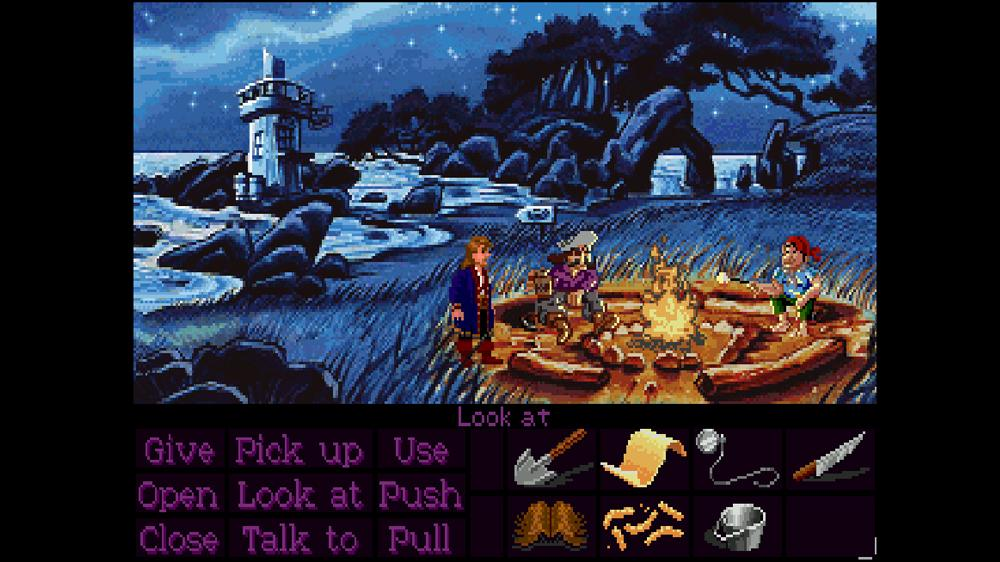
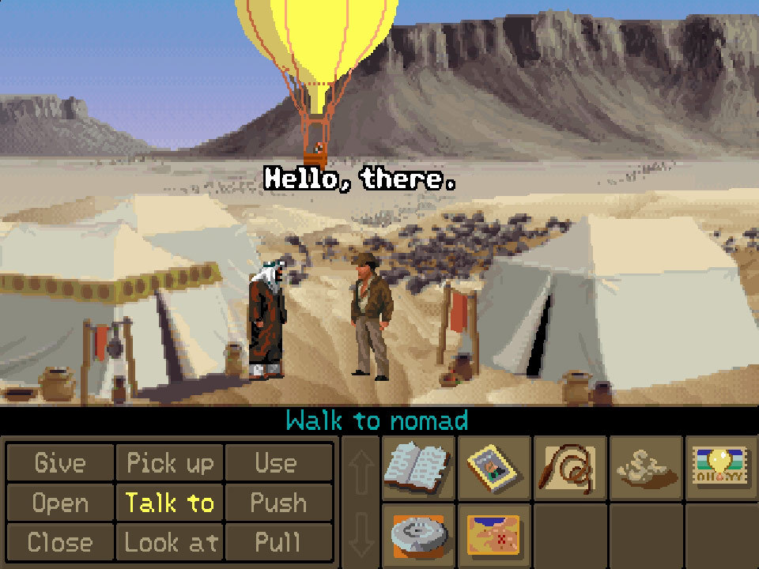
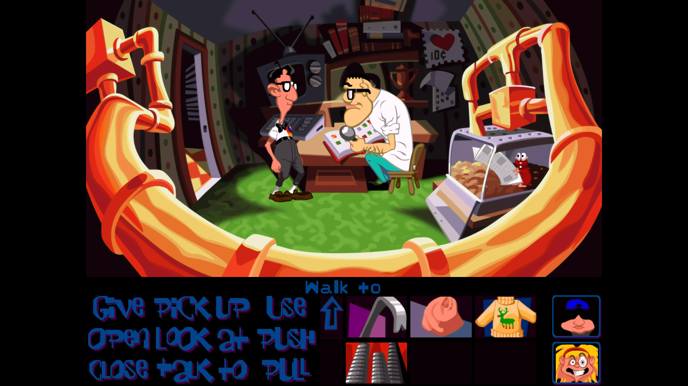
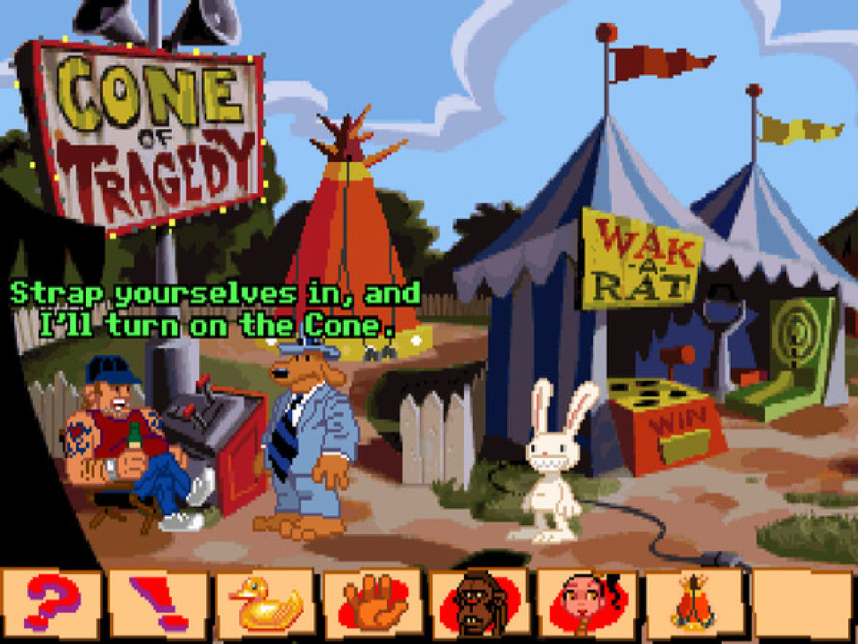
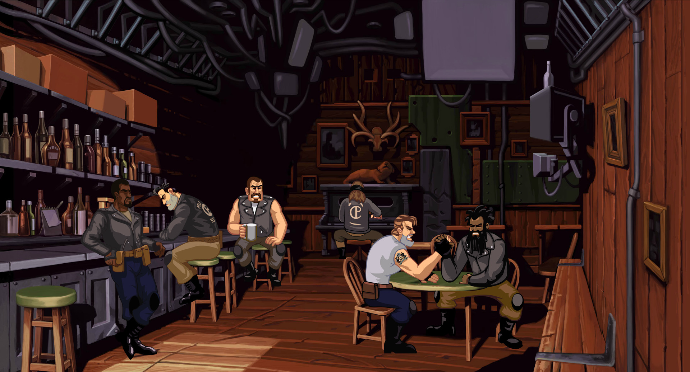
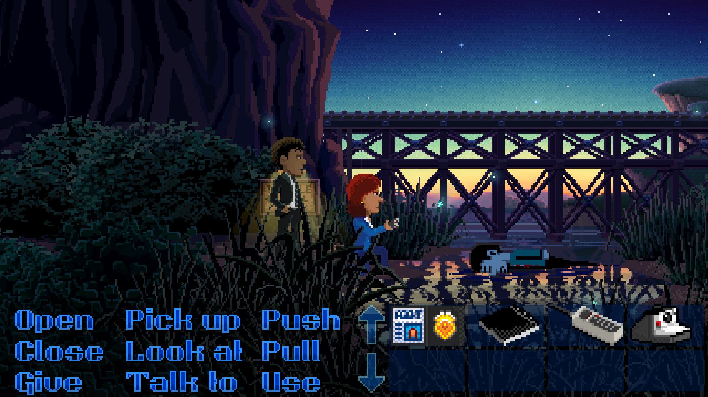
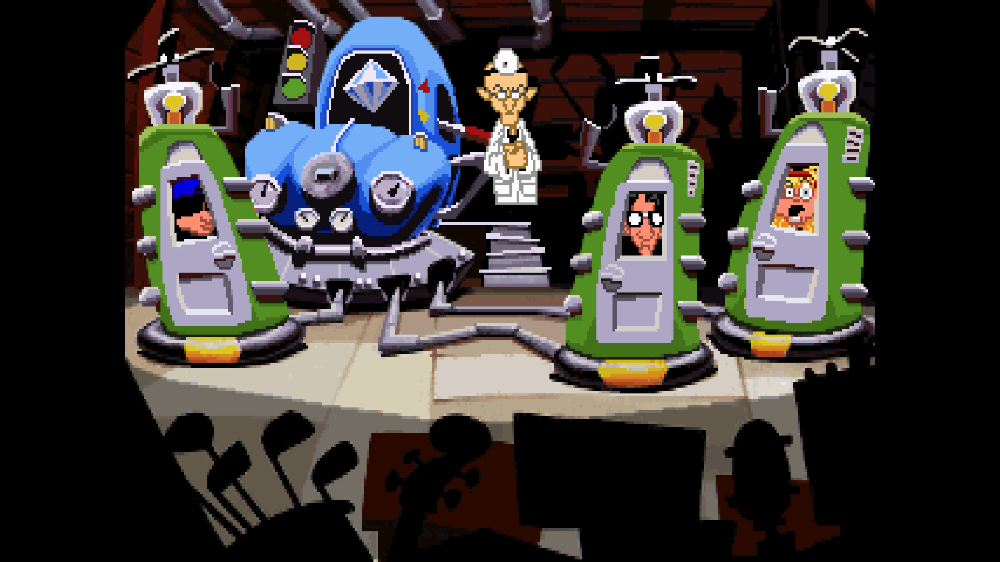
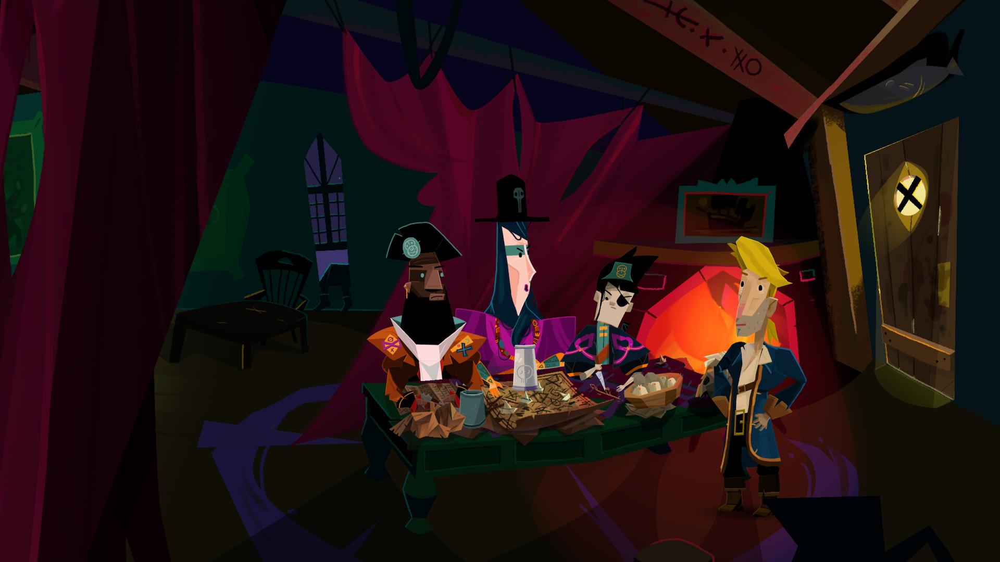

# Interfacce delle avventure grafiche classiche: scena, comandi e inventario

Data della ricerca: 9 agosto 2026  
Domanda: quale relazione spaziale esiste fra scena, comandi e inventario nelle avventure vicine a *Monkey Island 2*, e quali architetture possiamo considerare per Fondale?

## Risultato in breve

La ricerca separa tre architetture che, pur mostrando talvolta gli stessi verbi, non sono equivalenti:

1. **A — Viewport ridotto con HUD dedicato e opaco.** La scena termina prima del pannello. Comandi, Sentence Line e Inventory occupano una fascia propria sotto la scena. È l'architettura di *Monkey Island 2*, *Indiana Jones and the Fate of Atlantis* e della UI classica di *Day of the Tentacle*.
2. **B — Scena full-frame con HUD persistente trasparente in overlay.** La scena continua dietro a comandi e Inventory, che la coprono parzialmente. È la reinterpretazione adottata da *Thimbleweed Park*.
3. **C — Controlli contestuali o nascosti.** La scena usa quasi tutto il frame; verbi e/o Inventory appaiono solo quando richiesti o vicino al cursore. La linea evolutiva va da *Sam & Max Hit the Road* e *Full Throttle* fino a *Return to Monkey Island*.

La conseguenza principale è semplice: dire «come *Monkey Island 2*, ma trasparente» combina **A** e **B**, due decisioni strutturali in tensione. Prima di discutere misure, slot o colori bisogna scegliere quale delle tre architetture si vuole.

## Decisione successiva alla ricerca

Il **9 agosto 2026** è stata selezionata l'architettura **C — controlli contestuali o nascosti** attraverso il prototipo comparativo conservato nel commit `e962ab4`.

La decisione stabilisce che la Scene occupa l'intero frame a riposo e che Verb e Inventory non formano un HUD inferiore persistente. Non stabilisce ancora il gesto che apre l'Inventory, il modo in cui si richiude o la presentazione esatta dei Verb contestuali: queste restano decisioni separate da affrontare una alla volta prima di modificare il contratto di produzione.

## Metodo e limiti delle misure

Sono state usate solo fonti o artefatti primari:

- manuali originali Lucasfilm/LucasArts;
- pagine e devlog degli sviluppatori;
- pagine ufficiali di publisher;
- screenshot forniti da sviluppatori o publisher agli store ufficiali.

Gli screenshot sono stati scaricati senza ritaglio dai CDN di Steam. Le percentuali verticali sono **stime visive**, calcolate rispetto al frame di gioco visibile e arrotondate a intervalli di circa 2–3 punti percentuali. Barre nere laterali e letterboxing non sono conteggiati come HUD. La stima descrive lo screenshot selezionato, non ogni porta o versione del gioco.

Nel testo:

- **Dichiarato** indica ciò che dice una fonte primaria;
- **Osservato** indica ciò che è direttamente visibile nell'immagine;
- **Inferenza** indica una conseguenza progettuale ricavata dai fatti precedenti.

## Matrice comparativa

| Gioco | Anno / versione osservata | Architettura | Scena visibile | HUD / UI persistente | Inventory | Trasparenza e sovrapposizione |
|---|---:|---|---:|---:|---|---|
| *Monkey Island 2* | 1991, modalità grafica classica nella Special Edition | **A** | ~66–68% | ~32–34% | 8 celle visibili, a destra dei verbi | Pannello opaco; la scena finisce sopra |
| *Fate of Atlantis* | 1992 | **A** | ~71–73% | ~27–29% | Griglia persistente a destra | Pannello opaco; nessuna invasione della scena |
| *Day of the Tentacle* | UI classica mostrata nel Remaster 2016 | **A** | ~71–73% | ~27–29% | Griglia persistente a destra | Pannello nero opaco; scena separata |
| *Sam & Max Hit the Road* | 1993 | **C** | ~92–94% | solo sottile barra di icone, ~6–8% | finestra separata richiamabile | niente elenco persistente di verbi sulla scena |
| *Full Throttle* | 1995 / Remaster 2017 | **C** | ~100% a UI chiusa | 0% a riposo | pannello a teschio richiamabile | verb coin e Inventory temporanei |
| *Thimbleweed Park* | 2017 | **B** | ~100% dietro la UI | overlay ~23–26% | persistente a destra nell'overlay | trasparente; verbi e oggetti coprono la scena |
| *Day of the Tentacle Remastered* | UI moderna 2016 | **C / ibrida** | ~100% a UI chiusa | 0% a riposo | richiamabile | modalità UI separabile da grafica/audio |
| *Return to Monkey Island* | 2022 | **C** | ~100% a UI chiusa | 0% nello screenshot | sistema richiamabile e contestuale | nessun HUD inferiore persistente |

## A — Viewport ridotto e pannello dedicato

### Monkey Island 2: il riferimento strutturale

**Osservato.** La Animation Window occupa circa due terzi dell'altezza. Sotto c'è una fascia nera opaca: Sentence Line in alto, nove verbi su tre righe a sinistra, Inventory a destra. Gli oggetti non sono sopra la scena; sono sotto il suo limite.

**Dichiarato.** Il [manuale originale di *Monkey Island 2*](https://mocagh.org/lucasfilm/mi2uk-alt-manual.pdf#page=3) descrive lo schermo come diviso in sezioni. Definisce la Animation Window come parte maggiore, colloca i verbi in basso a sinistra, la Sentence Line direttamente sotto la Animation Window e le icone Inventory a destra dei verbi. Specifica inoltre otto oggetti visibili e frecce di scorrimento oltre l'ottavo. Il manuale documenta anche l'auto-highlight del verbo appropriato e l'esecuzione rapida con tasto destro o Tab.

**Inferenza.** L'opacità non è un trattamento cosmetico applicato a una scena full-frame: il pannello fa parte del layout e riduce il viewport. Rendere trasparente la stessa fascia senza cambiare la composizione produce un'altra architettura.

Fonte immagine: screenshot classico distribuito nella [pagina Steam ufficiale](https://store.steampowered.com/app/32460/) della Special Edition, sviluppata e pubblicata da LucasArts; non è la UI modernizzata della Special Edition.

### Indiana Jones and the Fate of Atlantis: la fascia viene resa più esplicita

**Osservato.** La scena termina nettamente intorno al 72% del frame. La Sentence Line la separa dal pannello marrone. I nove verbi sono pulsanti rettangolari 3×3; Inventory e frecce occupano il resto della fascia. Nessun oggetto Inventory invade la scena.

**Inferenza.** Rispetto a *Monkey Island 2*, bordi e celle aumentano la leggibilità e rendono più chiaro cosa è cliccabile, ma il costo verticale resta simile. La fascia dedicata permette all'artista di conoscere esattamente il limite inferiore della scena interattiva.

Fonte immagine: screenshot fornito da LucasArts/Lucasfilm/Disney nella [pagina Steam ufficiale](https://store.steampowered.com/app/6010/).

### Day of the Tentacle: stessa architettura, composizione più grafica

**Osservato.** La UI occupa circa il 28% inferiore. La scena termina sopra la Sentence Line; il fondo del pannello è nero e opaco. Verbi, Inventory e ritratti dei personaggi sono tutti nella fascia dedicata.

L'immagine non pretende di essere una cattura dell'eseguibile DOS originale: mostra la UI classica insieme alla grafica remastered. È però un confronto primario particolarmente utile perché Double Fine dichiara che il Remaster permette di combinare separatamente grafica, audio e interfaccia classici o moderni nella [pagina ufficiale del gioco](https://www.doublefine.com/games/day-of-the-tentacle-remastered).

**Inferenza.** Anche con grafica moderna a 16:9, mantenere la UI classica significa mantenere una divisione forte della composizione: non basta cambiare asset o font.

## C — Dal pannello persistente ai controlli contestuali

### Sam & Max Hit the Road: i verbi passano nel cursore

**Osservato.** La scena usa circa il 92–94% dell'altezza. Rimane una piccola barra opaca di icone in basso, ma non l'elenco 3×3 dei verbi né una griglia Inventory persistente.

**Dichiarato.** Il [manuale originale di *Sam & Max Hit the Road*](https://mocagh.org/lucasfilm/sammax-manual.pdf#page=3) elenca cinque action mode — Walk To, Look At, Pick Up, Talk To e Use — selezionabili ciclicamente e visibili sul cursore. L'Inventory si attiva e disattiva separatamente; gli stessi verb icon, eccetto Walk, sono disponibili nella sua finestra.

**Inferenza.** La riduzione dello spazio non deriva da trasparenza o da slot più piccoli: deriva dalla rimozione della persistenza. Il prezzo è che la grammatica dei comandi non è tutta visibile contemporaneamente.

Fonte immagine: screenshot fornito da Lucasfilm/Disney nella [pagina Steam ufficiale](https://store.steampowered.com/app/355170/).

### Full Throttle: verb coin e Inventory appaiono su richiesta

**Osservato.** Lo screenshot ufficiale mostra la scena fino al bordo inferiore, senza pannello persistente.

**Dichiarato.** Il manuale LucasArts incluso in [*The LucasArts Archives, Vol. III*](https://www.mocagh.org/lucasfilm/lucasartsarchives3-manual.pdf#page=25) spiega che l'interfaccia dei verbi compare solo tenendo premuto il pulsante sinistro sopra un hotspot; Look, Talk/Use Mouth, Pick Up/Punch/Use e Kick sono presentati intorno al cursore. Il pulsante destro apre invece l'Inventory a teschio, che mostra fino a quattro oggetti per volta e scompare quando si esce dal pannello.

**Inferenza.** Qui scena e UI non competono stabilmente per lo spazio. In cambio, le azioni possibili devono essere apprese e l'interfaccia deve comunicare con chiarezza quando esiste un hotspot.

Fonte immagine: screenshot fornito da Double Fine nella [pagina Steam ufficiale](https://store.steampowered.com/app/228360/).

## B — La reinterpretazione trasparente di Thimbleweed Park

**Osservato.** L'ambiente prosegue fino al bordo inferiore del frame. Negli ultimi ~23–26% sono sovrapposti i nove verbi e l'Inventory; vegetazione, acqua e personaggi rimangono visibili dietro le parole e gli oggetti. L'Inventory è quindi dentro l'overlay e **invade visivamente la scena** tanto quanto i verbi.

**Dichiarato.** Nei devlog di Terrible Toybox:

- Ron Gilbert dice che la prima UI a verbi funziona più come *Monkey Island* che come *Maniac Mansion* e richiama auto-scan e Sentence Line in [*UI in Action*](https://blog.thimbleweedpark.com/ui_in_action.html).
- Durante la prima implementazione dell'Inventory afferma che non rimane spazio per un altro verbo e che vuole evitare ulteriore clutter in [*Switching and Inventory*](https://blog.thimbleweedpark.com/switching_and_inventory.html).
- In [*UI Changes*](https://blog.thimbleweedpark.com/ui_changes.html) documenta la rimozione della Sentence Line fissa dopo prove di gioco: il feedback dell'azione viene portato vicino al cursore, mentre resta disponibile una modalità classica.
- Nel successivo [*Verbs and Adventure Games*](https://grumpygamer.com/verbs_verbs_verbs/) definisce l'interfaccia a nove verbi funzionale ma scelta soprattutto per nostalgia e visivamente datata per un progetto nuovo.

Queste sono dichiarazioni degli autori dei post; i commenti dei lettori presenti nelle stesse pagine non sono stati usati come evidenza.

**Inferenza.** La trasparenza conserva più immagine percepita, ma non rende gratis lo spazio: testo e icone continuano a coprire dettagli, hotspot e personaggi. La scena deve essere composta con una safe area inferiore oppure accettare occlusioni. Se l'Inventory sta «sopra la scena», questo è precisamente il comportamento dell'architettura B, non un bug marginale della sua implementazione.

Fonte immagine: screenshot fornito da Terrible Toybox nella [pagina Steam ufficiale](https://store.steampowered.com/app/569860/).

## Reinterpretazioni moderne senza HUD persistente

### Day of the Tentacle Remastered, modalità moderna

**Osservato.** La stessa produzione può presentare una scena full-frame senza la fascia inferiore. **Dichiarato:** Double Fine permette di combinare interfaccia, grafica e audio classici o moderni. Questo rende il Remaster un caso utile di architetture alternative applicate allo stesso contenuto, non la prova che una fascia classica possa diventare overlay senza conseguenze.

Fonte immagine: screenshot fornito da Double Fine nella [pagina Steam ufficiale](https://store.steampowered.com/app/388210/).

### Return to Monkey Island

**Osservato.** Lo screenshot promozionale mostra la scena a pieno frame, senza comandi o Inventory persistenti. Da solo questo dimostra soltanto l'assenza della UI in quel particolare frame.

**Dichiarato.** La [pagina ufficiale Devolver Digital](https://www.devolverdigital.com/games/return-to-monkey-island) descrive esplicitamente interazioni context-sensitive, dialoghi reattivi e Inventory semplice come evoluzione moderna dei controlli classici.

**Inferenza.** Il progetto mantiene la logica point-and-click e gli oggetti combinabili senza mantenere la grammatica a nove verbi sempre esposta. È la distanza maggiore da *Monkey Island 2* sul piano della discoverability, ma la scelta più favorevole alla scena.

Fonte immagine: screenshot fornito da Terrible Toybox/Devolver Digital nella [pagina Steam ufficiale](https://store.steampowered.com/app/2060130/).

## Hover, tasto destro e Sentence Line

Le fonti mostrano che questi tre problemi possono essere separati dalla geometria del pannello:

| Funzione | MI2 / A | Thimbleweed / B | Sam & Max, Full Throttle, Return / C |
|---|---|---|---|
| Azioni disponibili | tutte visibili | tutte visibili | appaiono sul cursore o sono contestuali |
| Sentence Line | fissa fra scena e pannello | rimossa dalla posizione fissa; feedback vicino al cursore, modalità classica opzionale | assente o sostituita da feedback contestuale |
| Hover | nome dell'oggetto completa la frase | testo vicino al punto d'attenzione | cursore/hotspot comunica la possibilità |
| Tasto destro | esegue il verbo suggerito | shortcut compatibile con la grammatica classica | cicla modalità o apre Inventory, secondo il gioco |
| Costo spaziale | alto ma prevedibile | alto come occlusione, basso come ritaglio | basso; maggiore costo di apprendimento |

**Inferenza.** È possibile mantenere il tasto destro rapido e l'auto-highlight di MI2 anche scegliendo A. Non è necessario introdurre un overlay per ottenere queste comodità. Viceversa, rendere trasparente il pannello non risolve la distanza percorsa dal cursore fra scena e verbi.

## Provenienza degli screenshot acquisiti

Tutti i file sono copie non modificate degli screenshot publisher-supplied restituiti dalle pagine Steam ufficiali. Data di accesso: **9 agosto 2026**.

| File locale | Titolo / titolarità dichiarata dalla pagina | Pagina fonte | URL diretto acquisito | Cosa mostra |
|---|---|---|---|---|
| `monkey-island-2-classic-verbs-inventory.jpg` | LucasArts; publisher LucasArts | [Steam 32460](https://store.steampowered.com/app/32460/) | [CDN](https://shared.akamai.steamstatic.com/store_item_assets/steam/apps/32460/ss_973decd51ded354834f3fe20cfd85982bc9c7719.1920x1080.jpg) | vera modalità classica: scena, Sentence Line, nove verbi, Inventory |
| `fate-of-atlantis-classic-hud.jpg` | LucasArts; publisher LucasArts/Lucasfilm/Disney | [Steam 6010](https://store.steampowered.com/app/6010/) | [CDN](https://shared.akamai.steamstatic.com/store_item_assets/steam/apps/6010/ss_e166f6588ee19887c64b2851e836ec90c68a27d8.1920x1080.jpg) | fascia opaca con verbi e Inventory |
| `day-of-the-tentacle-classic-hud.jpg` | Double Fine Productions | [Steam 388210](https://store.steampowered.com/app/388210/) | [CDN](https://shared.akamai.steamstatic.com/store_item_assets/steam/apps/388210/ss_9eefffbc6bf66978cb5b8570665b09774d4f604a.1920x1080.jpg) | grafica remastered con UI classica dedicata |
| `day-of-the-tentacle-remastered-full-frame.jpg` | Double Fine Productions | [Steam 388210](https://store.steampowered.com/app/388210/) | [CDN](https://shared.akamai.steamstatic.com/store_item_assets/steam/apps/388210/ss_eec1dc6305f774af4eb030437e4d37c31318f0be.1920x1080.jpg) | modalità moderna senza pannello visibile |
| `sam-and-max-icon-strip.jpg` | Lucasfilm; publisher Lucasfilm/Disney | [Steam 355170](https://store.steampowered.com/app/355170/) | [CDN](https://shared.akamai.steamstatic.com/store_item_assets/steam/apps/355170/ss_9fe242903da2e4a994f3605649e0b6ac8d23f6a6.1920x1080.jpg) | scena quasi completa e barra minima di icone |
| `full-throttle-full-frame.jpg` | Double Fine Productions | [Steam 228360](https://store.steampowered.com/app/228360/) | [CDN](https://shared.akamai.steamstatic.com/store_item_assets/steam/apps/228360/ss_6d154dd81f76fd9a9dccaa49b96881a105eb5596.1920x1080.jpg) | scena senza UI persistente |
| `thimbleweed-park-transparent-overlay.jpg` | Terrible Toybox, sviluppatore e publisher | [Steam 569860](https://store.steampowered.com/app/569860/) | [CDN](https://shared.akamai.steamstatic.com/store_item_assets/steam/apps/569860/ss_704c62153ab86d4739dcc46319c1c0b26c3b6d5e.1920x1080.jpg) | nove verbi e Inventory trasparenti sopra la scena |
| `return-to-monkey-island-full-frame.jpg` | Terrible Toybox; publisher Devolver Digital | [Steam 2060130](https://store.steampowered.com/app/2060130/) | [CDN](https://shared.akamai.steamstatic.com/store_item_assets/steam/apps/2060130/ss_bd989f1025e559eec8d6993666323c9d06181a04.1920x1080.jpg) | scena full-frame senza HUD persistente |

## Opzioni applicabili a Fondale

Queste sono decisioni di architettura, non proposte di micro-dimensionamento.

### Opzione 1 — A: classico strutturale fedele a Monkey Island 2

- La scena termina sopra una fascia dedicata, indicativamente il 26–32% dell'altezza.
- Verbi, Sentence Line e Inventory restano tutti visibili e opachi.
- Gli asset di scena non passano mai dietro all'Inventory.
- Tradeoff: massima leggibilità e grammatica sempre esposta; minore spazio verticale per l'illustrazione.

### Opzione 2 — B: reinterpretazione Thimbleweed Park

- La scena occupa tutto il frame.
- Verbi e Inventory persistono in un overlay trasparente inferiore, indicativamente il 23–26%.
- La scena deve avere una safe area o accettare che comandi e oggetti ne coprano una parte.
- Tradeoff: più continuità visiva, ma l'Inventory è inevitabilmente sopra la scena e l'ingombro percettivo dei nove verbi rimane.

### Opzione 3 — C: interfaccia contestuale

- La scena occupa tutto il frame senza HUD inferiore persistente.
- Verbi compaiono vicino al cursore o sono selezionati contestualmente; Inventory è un drawer/pannello richiamabile.
- Tradeoff: priorità assoluta alla scena e minori spostamenti del cursore; grammatica meno visibile e maggiore distanza dall'identità MI2.

### Opzione 4 — Due modalità realmente distinte

- Modalità Classic = A; modalità Modern = C.
- Non si tenta di ottenere entrambe cambiando soltanto l'opacità dello stesso layout.
- Tradeoff: rispetta preferenze opposte, ma aumenta nettamente sviluppo, test, documentazione e manutenzione.

## Decisione da prendere

La prossima domanda non è «quanto devono essere piccoli gli slot?» né «quanta trasparenza?». È:

> **Fondale deve adottare A, una scena più piccola con pannello dedicato; B, una scena full-frame coperta da un overlay persistente; oppure C, controlli e Inventory contestuali/nascosti?**

Solo dopo questa scelta ha senso definire altezza, griglia, opacità, font e comportamento responsive.
